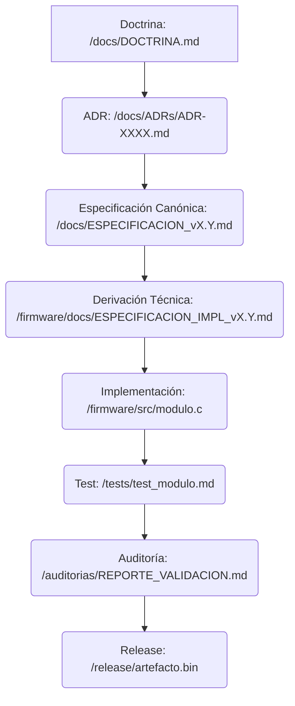

## Propósito
Este manifiesto establece las relaciones explícitas y la cadena de trazabilidad entre las diferentes capas del repositorio Centinela del Monte, asegurando que cualquier artefacto pueda ser rastreado hasta su origen doctrinal.

## Mapeo de la Cadena de Confianza

## Reglas de Referencia Cruzada
- Todo documento en `/firmware/docs` debe incluir `derived_from` (apuntando a `/docs`) y `related_adr`.
- Todo archivo de código en `/firmware/src` debe incluir comentarios que referencien la derivación técnica (`/firmware/docs`) y el ADR/doctrina original.
- Los documentos de test en `/tests` deben referenciar la implementación y la especificación que validan.
