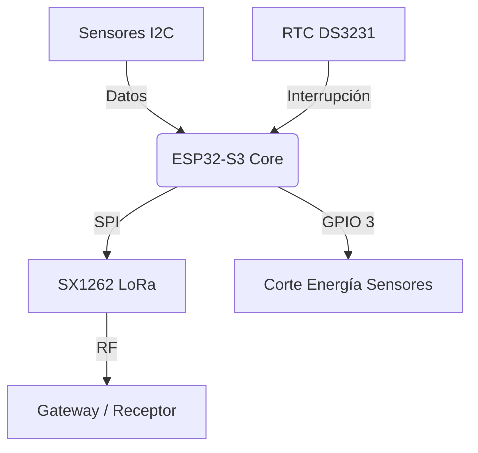

## Arquitectura Funcional

## Subsistemas
1. **Power Management:** Control de rieles de alimentación para sensores periféricos.
2. **Comunicaciones:** Stack LoRa optimizado para bajo consumo.
3. **Gobernanza:** Sistema de archivos Markdown con metadatos de integridad.