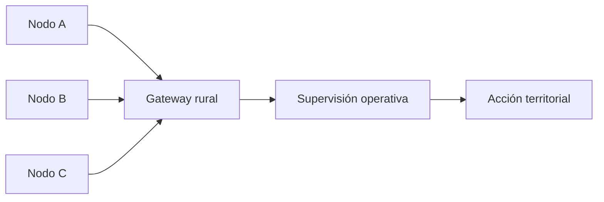

# NETWORK_FLOW_v1

## 1. Identidad del sistema
Representación visual del flujo territorial de red de Centinela.

## 2. Diagrama

## 3. Nota mínima
Este archivo visualiza el flujo; la explicación funcional canónica está en `SYSTEM_OVERVIEW_v1.md`.
