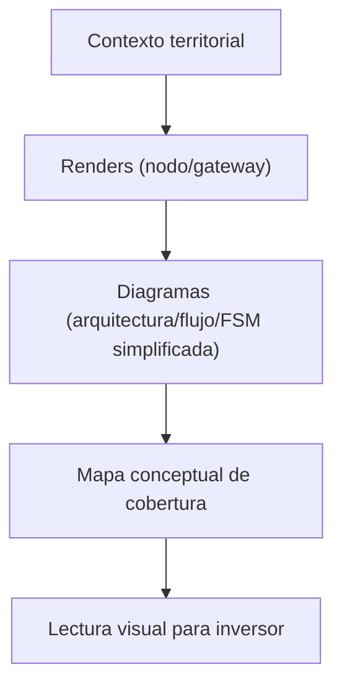

# VISUAL_ARCHITECTURE_v1

## 1. Identidad del sistema
La arquitectura visual de Centinela define cómo representar de forma coherente una infraestructura territorial resiliente.

## 2. Función operativa
Organizar la relación entre activos visuales para comprensión ejecutiva consistente entre deck, diagramas, mapas y mockups.

## 3. Componentes / flujo
Componentes visuales clave:
- representación de nodo en contexto rural,
- representación de gateway como punto de enlace,
- trazas de conectividad territorial,
- mapa conceptual de cobertura,
- diagramas de arquitectura y estado simplificado.

Flujo visual recomendado:
1. Contexto territorial.
2. Activos físicos (nodo y gateway).
3. Activos explicativos (diagramas y mapas).
4. Lectura visual para inversor.

Diagrama narrativo de activos:

## 4. Relación doctrinal
La representación visual se alinea doctrinalmente al priorizar sobriedad técnica, contexto territorial y coherencia entre activos.

## 5. Relevancia para inversor
Permite interpretar el sistema con claridad visual sin ingresar en detalle de implementación técnica.
